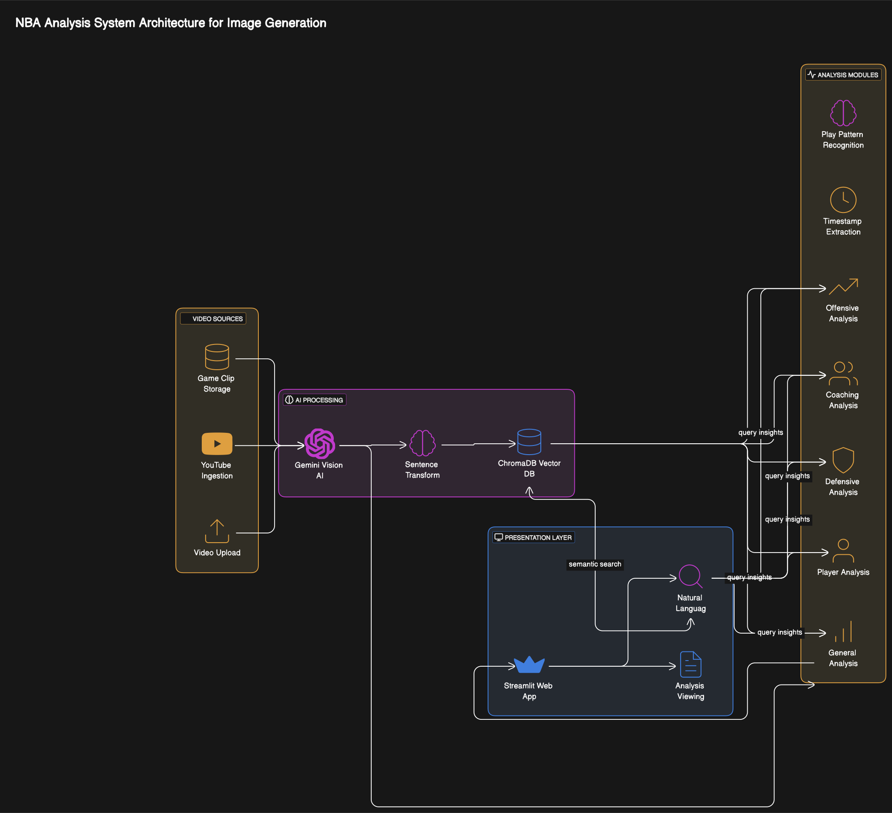

# 🏀 NBA Game Analysis System

An AI-powered tool that analyzes NBA game footage and provides professional-level insights using Google's Gemini vision model and semantic search capabilities.

## Overview

The NBA Game Analysis System is a lightweight, AI-driven application that transforms basketball video clips into detailed analytical breakdowns. Whether you're a coach, player, analyst, or basketball fan, this tool provides valuable insights into game strategy, player performance, and team dynamics.

The system can:
- Process NBA game clips from file uploads or YouTube links
- Generate multiple types of professional basketball analysis
- Store and search clips using vector embeddings
- Extract key moments with timestamps
- Present insights in a readable, shareable format

## Key Features

### Multiple Analysis Types

- **General Analysis**: Comprehensive overview of plays, performance, and strategy
- **Offensive Analysis**: Focus on offensive tactics, execution, and efficiency
- **Defensive Analysis**: Breakdown of defensive schemes, rotations, and effectiveness
- **Player Focus**: Detailed analysis of individual techniques and decision-making
- **Coaching Perspective**: Insights from a coach's viewpoint with teaching points

### Vector Search Capabilities

- Store clips in a vector database for semantic search
- Find relevant clips based on natural language queries
- Search by play types, players, strategies, or outcomes
- Compare similar plays across different games
- Build a knowledge base of basketball patterns

### User-Friendly Interface

- Simple upload flow for video files
- YouTube link support for easy clip acquisition
- Sample clips for testing without your own footage
- Clear navigation between system components
- Export options for sharing analysis

### AI-Powered Insights

- Timestamps for key moments
- Player identification and performance evaluation
- Strategic pattern recognition
- Professional basketball terminology
- Coaching points and improvement suggestions

## Installation

### Prerequisites

- Python 3.8+
- Google Gemini API key ([Get one here](https://ai.google.dev/))
- FFmpeg (optional, for advanced video processing)

### Setup

1. Clone the repository:
```bash
git clone https://github.com/yourusername/nba-analysis-system.git
cd nba-analysis-system
```

2. Install dependencies:
```bash
pip install -r requirements.txt
```

3. Set up your Gemini API key as an environment variable:
```bash
export GEMINI_API_KEY=your-api-key-here
```

### Running the Application

Start the web interface:
```bash
streamlit run nba_analysis_app.py
```

The application will be available at `http://localhost:8501`.

## System Components

### Clip Acquisition Module

Handles video ingestion from multiple sources:
- Local file uploads
- YouTube video links
- Sample clips for testing

### Vector Storage Module

Powers the semantic search functionality:
- Creates embeddings from processed clips
- Stores them in a ChromaDB vector database
- Enables similarity search and retrieval
- Handles metadata and segment indexing

### Direct Analysis Engine

Processes videos and generates insights using Google's Gemini AI:
- Sends video directly to the Gemini Vision model
- Formulates targeted prompts for different analysis types
- Extracts structured data with timestamps
- Provides summary and key moment extraction

### Streamlit User Interface

Provides an intuitive web interface for:
- Uploading and managing clips
- Configuring and generating analysis
- Searching the clip database
- Viewing and exporting results
- System documentation and guidance

## Usage Guide

### 1. Upload Clips

- Use the **Upload Clips** page to add videos to the system
- Either upload video files directly or provide YouTube links
- View previously uploaded clips and select one for analysis

### 2. Analyze Clips

- Choose an analysis type based on your needs
- Generate insights with a single click
- Preview analysis results immediately

### 3. Search and Compare

- Search your clip database with natural language queries
- Find similar plays across different games
- Compare analysis of different clips
- Build collections of related basketball patterns

### 4. View Analysis

- Read the complete analysis with timestamps
- Extract key segments for quick reference
- Export analysis in JSON or text formats

## Vector Database Usage

The system uses ChromaDB with Sentence Transformers for embedding generation and vector search:

```python
# Example of using the vector storage component directly
from vector_storage import VectorStorage

# Initialize storage
storage = VectorStorage()

# Add processed clip to the database
storage.add_clip(processed_data)

# Search for clips with semantically similar content
results = storage.search_clips("pick and roll defense against LeBron")

# Get detailed information for a specific clip
details = storage.get_clip_details("clip_123")
```

## Technical Architecture
System design image:



## Limitations

- Video file size should ideally be under 20MB
- Analysis quality depends on video clarity and content
- Requires internet connection for Gemini API access
- Vector search works best with a substantial clip collection

## Future Improvements

- Support for longer videos through automatic segmentation
- Batch processing for multiple clips
- Visual annotations on the video timeline
- Integration with team management systems
- Advanced statistical analysis and visualization
- Improved vector embeddings with domain-specific models

## Requirements

```
streamlit>=1.22.0
pandas>=1.5.0
google-generativeai>=0.3.0
chromadb>=0.4.18
sentence-transformers>=2.2.2
pytube>=12.0.0
requests>=2.28.0
numpy>=1.24.0
```

## Contributing

Contributions are welcome! Please feel free to submit a Pull Request.

## License

This project is licensed under the MIT License - see the LICENSE file for details.

## Acknowledgments

- Google's Gemini AI for powering the analysis engine
- Sentence Transformers and ChromaDB for vector search capabilities
- Streamlit for the web interface
- The basketball analysis community for inspiration and feedback

---

## Quick Command Reference

```bash
# Run the application
streamlit run nba_analysis_app.py

# Process a video directly from command line
python direct_analysis_engine.py analyze game_clip.mp4 --type offensive

# Extract key moments from an analysis
python direct_analysis_engine.py segments analysis_result.json

# Create a summary of an analysis
python direct_analysis_engine.py summarize analysis_result.json

# Add a clip to the vector database
python vector_storage.py add processed_clip.json

# Search for clips about defensive strategies
python vector_storage.py search "effective zone defense rotations"
```

For additional help or questions, please open an issue or contact [yadavalli.s@northeastern.edu].